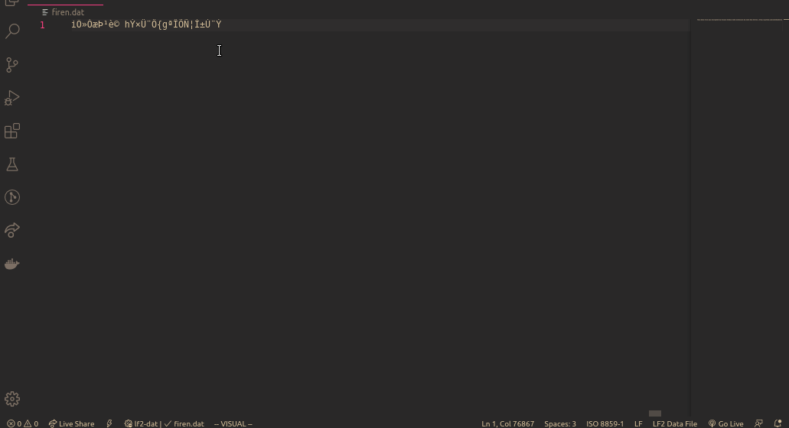

# LF2 Edit Tool README

Encrypting and decrypting Little Fighter 2 data files

## Commands

Open [Command Palette](https://code.visualstudio.com/docs/getstarted/userinterface#_command-palette).

Type `Encrypt document to LF2 data format.` to encrypt current document.

Type `Decrypt document to readable code.` to decrypt current document.

Type `Toggle encryption/decryption.` to toggle encryption/decryption on current document.

## Known Issues

Do not encrypt any files with UTF-8 encoding.

## Release Notes

### 1.0.0

Initial release.
